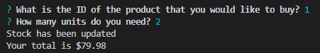
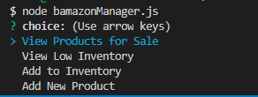
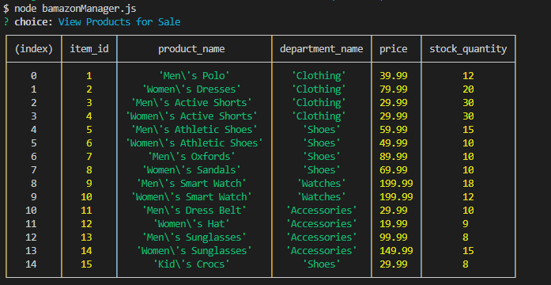
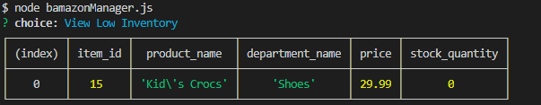
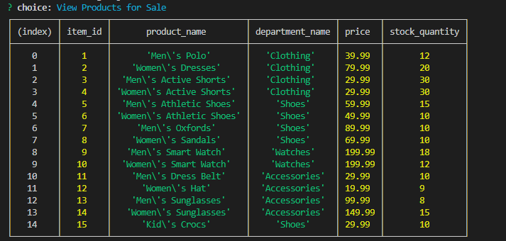

This is an Amazon-like storefront which takes in orders from customers and deplete stock from the store's inventory.

#1 - Customer.js

Running this application will first display all of the items available for sale.

The app would then prompt users with two messages.

   * The first asks the ID of the product you would like to buy.
   * The second message asks how many units of the product you would like to buy.
   
   
   
Once the customer has placed the order,application checks if store has enough of the product to meet the customer's request.

   * If not, the app logs a phrase like `Insufficient quantity!`, and then prevent the order from going through.
   
   
   
If store has enough of the product, the customer's order should be fulfilled.
   * This means updating the SQL database to reflect the remaining quantity.
   * Once the update goes through, show the customer the total cost of their purchase.
   
   
   
#2: Manager View

Running this application will: List a set of menu options:

    * View Products for Sale
    
    * View Low Inventory
    
    * Add to Inventory
    
    * Add New Product
    

If a manager selects `View Products for Sale`, the app should list every available item

If a manager selects `View Low Inventory`, then it should list all items with an inventory count lower than five.
    

If a manager selects `Add to Inventory`, app displays a prompt that will let the manager "add more" of any item currently in the store.

   
