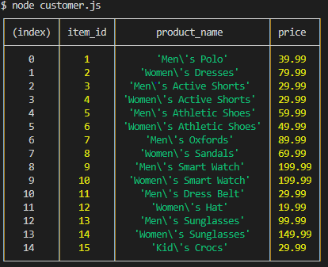
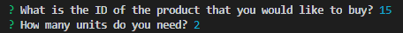
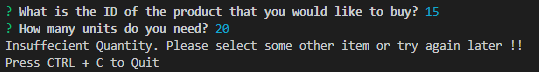

This is an Amazon-like storefront which takes in orders from customers and deplete stock from the store's inventory.

#1 - Customer.js

Running this application will first display all of the items available for sale.

The app would then prompt users with two messages.

   * The first asks the ID of the product you would like to buy.
   * The second message asks how many units of the product you would like to buy.
   
   
   
Once the customer has placed the order,application checks if store has enough of the product to meet the customer's request.

   * If not, the app logs a phrase like `Insufficient quantity!`, and then prevent the order from going through.
   
   
   
